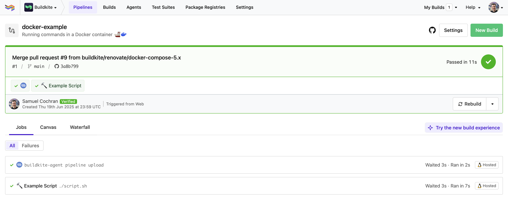

# Buildkite Docker Compose Pipeline Example

This repository is an example [Buildkite](https://buildkite.com/) pipeline that runs a simple bash script, [script.sh](script.sh), using [Docker Compose](https://github.com/buildkite/docker-compose-buildkite-plugin).

👉 **See this example in action:** [buildkite/docker-example](https://buildkite.com/buildkite/docker-example/builds/latest?branch=main)

<!-- docs:start -->

## How it works

This example uses the [Docker Compose plugin](https://github.com/buildkite/docker-compose-buildkite-plugin) to:

- Launch containers
- Run [script.sh](script.sh), which prints output, includes an inline image, generates artifacts, and exits cleanly

This example is functionally similar to the [bash example](https://github.com/buildkite/bash-example), but runs in a containerized environment.

<!-- docs:end -->

## License

See [LICENSE.md](LICENSE.md) (MIT)
